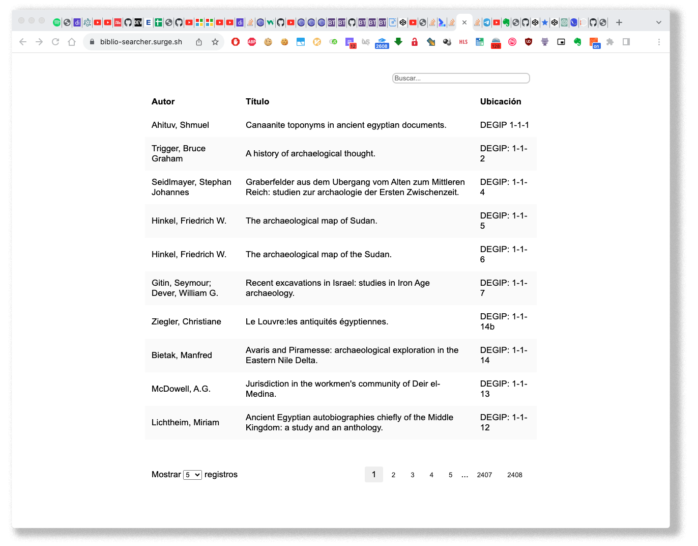

# RATIONALE #

* Internal tool that involves a database searcher of our library  and open to everyone
* The goals proposed and achieved have been minimalism in its design, consistency with other tools soon to appear, and speed of response
* This repo is a living document that will grow and adapt over time
  

### Tests
* Tested & validated in these browsers:
    * Internet Explorer
    * Microsoft Edge
    * Mozilla Firefox
    * Apple Safari
    * Vivaldi
    * Opera
    * Opera GX
    * Brave
    * Google Chrome
   
### Who do I talk to? ###
* Repo owner or admin
    - Contact `imhicihu` at `gmail` dot `com`
      
### Code of Conduct
* Please, check our [Code of Conduct](code_of_conduct.md)

### Legal ###
* All trademarks are the property of their respective owners.

### License ###
* The content of this project itself is licensed under the 
